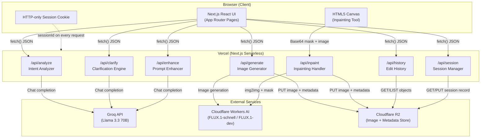
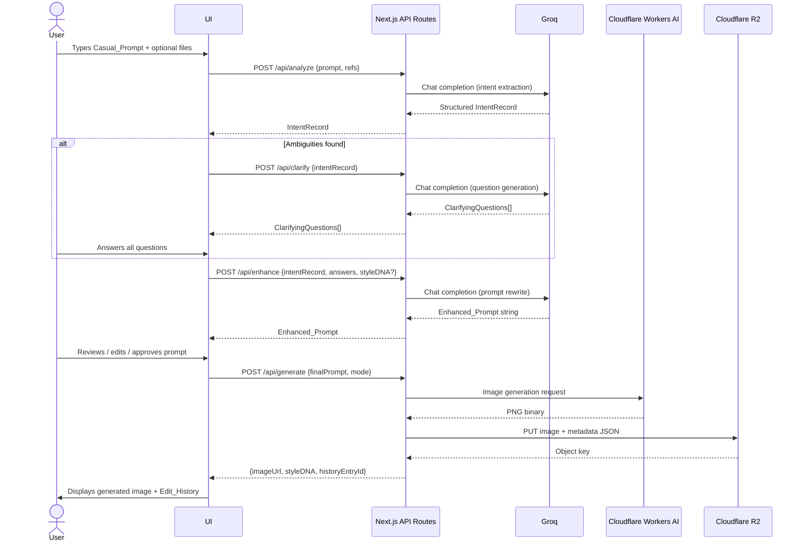
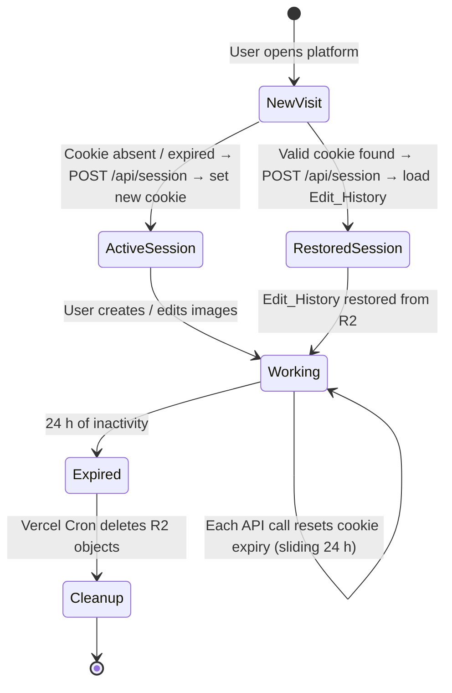

# Design Document: Smart AI Image Editor

## Overview

The Smart AI Image Editor is a Next.js web application that lets users describe image edits in plain language and receive high-quality AI-generated results. The platform abstracts all AI prompting complexity behind a guided pipeline: casual language → intent analysis → clarifying questions → prompt enhancement → prompt review → image generation → style-preserving edit history.

### Key Design Goals

- **Zero-friction UX**: No user accounts, no prompting knowledge required, session starts immediately on first visit.
- **Style continuity**: Every generated image carries a Style_DNA object; subsequent edits re-inject that DNA so outputs stay visually coherent.
- **Server-side security**: All LLM and image-generation API keys live exclusively in Next.js API routes; nothing is ever exposed to the browser.
- **Free-tier sustainability**: Every external dependency (Groq, Cloudflare Workers AI, Cloudflare R2, Vercel) operates within free-tier limits by design.
- **Targeted editing**: A canvas-based inpainting tool lets users paint a mask over a region and describe only that area's change.

### Tech Stack Summary

| Layer | Choice | Rationale |
|---|---|---|
| Frontend / SSR | Next.js 14 (App Router) on Vercel | Full-stack React, file-based routing, serverless API routes |
| LLM | Groq API — Llama 3.3 70B | Fast inference, free tier, excellent instruction-following |
| Image Generation | Cloudflare Workers AI — FLUX.1-schnell / FLUX.1-dev | Free tier, two quality modes, supports img2img/inpainting |
| Image Storage | Cloudflare R2 | S3-compatible, free tier, low egress cost |
| Session State | HTTP-only secure cookie (24 h sliding) | No auth friction, works across page reloads |
| Canvas / Mask | HTML5 Canvas API + React refs | Zero-dependency inpainting brush in-browser |


---

## Architecture

### System Component Diagram



### Request Flow — Happy Path




---

## Components and Interfaces

### Frontend Page Structure

```
app/
├── page.tsx                     # Root — redirects to /editor
├── editor/
│   └── page.tsx                 # Main editor shell (layout + routing between steps)
├── layout.tsx                   # Root layout (fonts, global CSS, session bootstrap)
└── components/
    ├── PromptInput/
    │   ├── PromptInput.tsx       # Textarea + char counter + file drop zone
    │   └── FilePreview.tsx      # Thumbnail / filename chips for Reference_Inputs
    ├── IntentDisplay/
    │   └── IntentDisplay.tsx    # Read-only accordion showing extracted attributes
    ├── ClarificationPanel/
    │   ├── ClarificationPanel.tsx  # Renders 2-3 question cards
    │   └── QuestionCard.tsx     # Radio options + "Other" free-text toggle
    ├── PromptReview/
    │   ├── PromptReview.tsx     # Side-by-side original + enhanced prompt
    │   ├── ModeSelector.tsx     # Fast / Quality radio toggle
    │   └── RegenerateButton.tsx # Clears enhanced prompt, re-invokes enhancer
    ├── ImageViewer/
    │   ├── ImageViewer.tsx      # Displays generated image with overlay controls
    │   └── GenerationOverlay.tsx  # Loading spinner + progress messaging
    ├── EditHistory/
    │   ├── EditHistoryPanel.tsx # Horizontal thumbnail timeline
    │   └── HistoryThumb.tsx    # Individual thumbnail + selection highlight
    ├── InpaintingTool/
    │   ├── InpaintingTool.tsx  # Canvas wrapper + brush controls
    │   ├── BrushSizeSlider.tsx # 5–100 px range input
    │   └── MaskCanvas.tsx      # HTML5 Canvas overlay + pointer events
    └── shared/
        ├── ErrorBanner.tsx     # Inline / toast error display
        ├── LoadingSpinner.tsx
        └── CharCounter.tsx     # Reusable remaining-character display
```

### Editor Step Machine

The editor uses a linear step machine managed in a React context (`EditorContext`). Each step maps to a discrete UI panel:

```
IDLE → ANALYZING → CLARIFYING → ENHANCING → REVIEWING → GENERATING → DONE
                                                                        ↓
                                                              (loops back to IDLE
                                                               with new context
                                                               for next edit)
```

State transitions are driven by API responses; the UI simply renders the panel corresponding to the current step.

### API Route Interfaces

Each API route accepts and returns typed JSON. All routes read the `sessionId` from the HTTP-only cookie via `cookies()` from `next/headers`.

#### `POST /api/session`
Bootstraps or validates a session.
```ts
// Response
{ sessionId: string; isNew: boolean; historyCount: number }
```

#### `POST /api/analyze`
```ts
// Request
{
  prompt: string;                  // max 2000 chars
  referenceFiles?: ReferenceFile[] // base64-encoded, max 5, max 10 MB each
}
// Response
{
  intentRecord: IntentRecord;
  hasAmbiguities: boolean;
}
```

#### `POST /api/clarify`
```ts
// Request
{ intentRecord: IntentRecord }
// Response
{ questions: ClarifyingQuestion[] } // 2–3 items
```

#### `POST /api/enhance`
```ts
// Request
{
  intentRecord: IntentRecord;
  clarificationAnswers: ClarificationAnswer[];
  styleDNA?: StyleDNA;             // present when editing existing image
  isInpainting?: boolean;
  maskCoverage?: number;           // 0–1 fraction of image covered
}
// Response
{ enhancedPrompt: string }         // 50–500 chars
```

#### `POST /api/generate`
```ts
// Request
{
  finalPrompt: string;             // user-approved, max 4000 chars
  mode: "fast" | "quality";
}
// Response
{
  historyEntryId: string;
  imageUrl: string;                // signed R2 URL, 24 h expiry
  styleDNA: StyleDNA;
}
```

#### `POST /api/inpaint`
```ts
// Request
{
  sourceImageKey: string;          // R2 object key of base image
  maskDataUrl: string;             // data:image/png;base64,... binary mask
  finalPrompt: string;
  mode: "fast" | "quality";
}
// Response
{
  historyEntryId: string;
  imageUrl: string;
  styleDNA: StyleDNA;
}
```

#### `GET /api/history`
```ts
// Response
{ entries: HistoryEntry[] }        // ordered oldest → newest, max 50
```


---

## Data Models

### `IntentRecord`
Produced by `/api/analyze`. Contains the structured extraction of the Casual_Prompt.

```ts
interface IntentRecord {
  primarySubject:  string | null;  // null = "absent" sentinel
  setting:         string | null;
  artisticStyle:   string | null;
  moodOrTone:      string | null;
  colorPaletteCues: string | null;
  rawPrompt:       string;         // original Casual_Prompt, preserved
  referenceFileCount: number;
}
```

Design decision: `null` is used (not `undefined` or field omission) so that downstream consumers can distinguish "not determinable" from "not asked". This satisfies Requirement 2.2.

---

### `ClarifyingQuestion`
```ts
interface ClarifyingQuestion {
  id:        string;               // uuid, stable across re-renders
  attribute: string;               // which IntentRecord field this resolves
  question:  string;               // human-readable question text
  options:   string[];             // 3–5 derived options
  // "Other" option is always rendered by the UI; it is NOT included here
}
```

---

### `ClarificationAnswer`
```ts
interface ClarificationAnswer {
  questionId: string;
  selectedOption: string;          // one of options[], or the free-text value
  isOther: boolean;
}
```

---

### `StyleDNA`
Computed after every successful image generation by the `/api/generate` and `/api/inpaint` routes using a Groq LLM call that analyses the returned image's description alongside the Enhanced_Prompt.

```ts
interface StyleDNA {
  dominantColors:    string[];     // 3–8 hex codes, e.g. ["#1a2b3c", ...]
  artisticStyleLabel: string;      // e.g. "oil painting", "cyberpunk render"
  lightingDescriptor: string;      // e.g. "golden hour backlit"
  textureDescriptor:  string;      // e.g. "rough canvas brushwork"
}
```

Storage: serialised as JSON and stored in R2 alongside the image (see Storage Structure below).

---

### `HistoryEntry`
One item in the Edit_History timeline.

```ts
interface HistoryEntry {
  id:              string;          // uuid
  sessionId:       string;
  createdAt:       string;          // ISO 8601
  imageKey:        string;          // R2 object key
  imageUrl:        string;          // signed R2 URL (regenerated on read)
  thumbnailKey:    string;          // R2 key for 160×160 JPEG thumbnail
  casualPrompt:    string;
  enhancedPrompt:  string;
  styleDNA:        StyleDNA;
  mode:            "fast" | "quality";
  isInpainted:     boolean;
  parentEntryId:   string | null;   // for inpainted images, points to source
}
```

---

### `Session`
Stored in R2 at `sessions/{sessionId}/session.json`.

```ts
interface Session {
  sessionId:    string;             // uuid v4
  createdAt:    string;             // ISO 8601
  lastActiveAt: string;             // updated on every API request
  entryCount:   number;             // maintained to enforce 50-entry cap
}
```

---

### `InpaintMask`
Not persisted; lives in browser memory as a `data:image/png;base64` string on the `MaskCanvas` component. It is sent to `/api/inpaint` as part of the request body and converted to a binary `ArrayBuffer` in the API route before being forwarded to Cloudflare Workers AI.

```ts
// Client-side canvas state
interface InpaintState {
  sourceEntryId: string;           // HistoryEntry being edited
  maskDataUrl:   string;           // data:image/png;base64,...
  brushSize:     number;           // 5–100 px
  maskCoverage:  number;           // 0–1 fraction, computed on every stroke
}
```

---

### `ReferenceFile`
```ts
interface ReferenceFile {
  name:        string;
  mimeType:    "image/jpeg" | "image/png" | "image/webp" | "application/pdf" | "text/plain";
  sizeBytes:   number;
  dataUrl:     string;             // base64 data URL, stripped before Groq call
}
```


---

## Storage Structure (Cloudflare R2)

All objects live in a single R2 bucket. The key namespace is structured as follows:

```
sessions/{sessionId}/session.json
sessions/{sessionId}/history/{entryId}/image.png
sessions/{sessionId}/history/{entryId}/thumbnail.jpg
sessions/{sessionId}/history/{entryId}/metadata.json
```

`metadata.json` contains the full `HistoryEntry` object minus the `imageUrl` (which is a signed URL generated at read time, not stored).

### 50-Entry Cap Enforcement

When `/api/generate` or `/api/inpaint` completes and `session.entryCount >= 50`:
1. Read `GET /sessions/{sessionId}/history/` listing, sort by `createdAt` ascending.
2. Take the oldest entry key prefix.
3. Delete `image.png`, `thumbnail.jpg`, and `metadata.json` under that prefix.
4. Decrement `entryCount` in `session.json`.
5. Then write the new entry and increment `entryCount`.

### Session Expiry Cleanup

A Vercel Cron Job (free tier: 1 invocation/day) calls a `GET /api/cron/cleanup` route. It:
1. Lists all `sessions/*/session.json` objects in R2.
2. Parses `lastActiveAt` for each.
3. Deletes the entire `sessions/{sessionId}/` prefix for sessions where `lastActiveAt` is older than 24 hours.

---

## User Journey: Full Flow Detail

### Step 1 — Casual Prompt Intake
- `PromptInput` renders a `<textarea>` wired to character counter. At 2,000 chars the `maxLength` attribute is enforced and the counter turns red.
- File drop zone validates MIME type and size client-side before accepting; failures show `ErrorBanner` inline.
- "Submit" is disabled until the prompt contains at least 1 non-whitespace character.

### Step 2 — Intent Analysis (`/api/analyze`)
- System prompt instructs Llama 3.3 70B to return a strict JSON object matching `IntentRecord`.
- Response is validated with a Zod schema in the API route. If the model returns malformed JSON, the route retries once with an explicit "respond only with JSON" instruction.
- If `primarySubject` is `null` after analysis, the route returns `{ error: "no_primary_subject" }` (HTTP 422); the UI shows the inline message from Requirement 2.5 and does not advance.

### Step 3 — Clarification Engine (`/api/clarify`)
- Only invoked when `hasAmbiguities === true`.
- System prompt instructs the LLM to return exactly 2–3 questions, each targeting a distinct `IntentRecord` field that is `null` or vague. No two questions may share the same `attribute` value.
- UI renders `QuestionCard` for each question; "Submit Answers" button is disabled until every card has a selection.

### Step 4 — Prompt Enhancement (`/api/enhance`)
- Assembles a structured user message from `IntentRecord` + `ClarificationAnswer[]` + optional `StyleDNA`.
- System prompt instructs the model to output only the Enhanced_Prompt string (50–500 chars), covering subject, style, composition, lighting, color palette, and mood.
- When `isInpainting === true`, the system prompt additionally instructs the model to include an explicit "only modify the masked region; preserve everything outside the mask" clause.
- When `styleDNA` is present, each of the four Style_DNA attributes is injected directly into the system prompt with the instruction to reference them verbatim.

### Step 5 — Prompt Review (`PromptReview` component)
- Displays original `casualPrompt` (read-only) and `enhancedPrompt` (editable textarea, max 4,000 chars).
- `ModeSelector` defaults to `"fast"`.
- "Regenerate" sets `isRegenerating = true`, calls `/api/enhance` again, disables "Approve & Generate" until response arrives.
- "Approve & Generate" is enabled only when `enhancedPrompt.trim().length > 0` and `!isRegenerating`.

### Step 6 — Image Generation (`/api/generate`)
- Constructs Cloudflare Workers AI request body:
  - `model`: `@cf/black-forest-labs/flux-1-schnell` or `@cf/black-forest-labs/flux-1-dev`
  - `prompt`: approved `finalPrompt`
  - Response format: `arraybuffer` (PNG binary)
- Generates Style_DNA via a second Groq call: passes the `finalPrompt` and asks the model to infer `dominantColors`, `artisticStyleLabel`, `lightingDescriptor`, `textureDescriptor` as JSON.
- Generates a 160×160 JPEG thumbnail using the `sharp` library (server-side, Vercel-compatible).
- Writes image, thumbnail, and metadata to R2 under `sessions/{sessionId}/history/{newEntryId}/`.
- Returns a signed R2 URL (24 h expiry) for immediate display.

### Step 7 — Inpainting Flow
1. User selects an existing `HistoryEntry` and clicks "Edit a specific area".
2. `InpaintingTool` opens: the source image is rendered on a `<canvas>`. A semi-transparent red overlay canvas sits on top.
3. `MaskCanvas` listens to `pointerdown` / `pointermove` / `pointerup` to draw filled circles at the brush position. Brush size is controlled by `BrushSizeSlider` (5–100 px).
4. On every stroke end, `maskCoverage` is computed: count non-transparent pixels in the mask canvas ÷ total pixels.
5. "Clear Mask" resets the mask canvas via `ctx.clearRect`.
6. On submit: if `maskCoverage < 0.01`, a confirmation dialog appears (Requirement 8.10). Otherwise, `maskDataUrl` (PNG data URL of the mask canvas) and `sourceImageKey` are sent to `/api/inpaint`.
7. `/api/inpaint` downloads the source image from R2, converts the mask data URL to a Buffer, and forwards both to Cloudflare Workers AI's img2img endpoint with the `finalPrompt`.


---

## Style DNA Computation and Storage Strategy

Style_DNA is computed entirely on the server after image generation succeeds, so it never blocks the image display.

### Computation Method

Because Cloudflare Workers AI returns raw PNG bytes (not a description), Style_DNA is derived by sending the `finalPrompt` (which fully describes the visual output) to Groq with the following structured extraction prompt:

```
Given this image generation prompt: "<finalPrompt>"
Extract the following attributes as JSON:
- dominantColors: array of 3–8 hex color codes that would dominate this image
- artisticStyleLabel: a short label describing the artistic style (e.g. "impressionist oil painting")
- lightingDescriptor: a short phrase describing the lighting (e.g. "soft diffused afternoon light")
- textureDescriptor: a short phrase describing the texture/surface quality (e.g. "smooth glossy render")
Respond only with valid JSON.
```

This approach is fast (one LLM call, no image analysis), consistent (deterministic given the same prompt), and free.

### Fallback

If the Groq call for Style_DNA computation fails, a default `StyleDNA` is constructed by extracting color words from the `finalPrompt` using a regex, and using "digital art" / "ambient lighting" / "smooth" as defaults. The image is still saved; Style_DNA defaults never block generation.

### Storage

`metadata.json` at `sessions/{sessionId}/history/{entryId}/metadata.json` contains the full `HistoryEntry` including the `StyleDNA` object. When a user initiates a follow-up edit, `/api/enhance` reads this metadata and injects the four Style_DNA fields into the enhancement system prompt.

---

## Session Lifecycle



Session ID is a `crypto.randomUUID()` v4 UUID generated server-side on first visit. It is set as:
```
Set-Cookie: sessionId=<uuid>; HttpOnly; Secure; SameSite=Strict; Max-Age=86400; Path=/
```
Each API route calls `updateSessionActivity(sessionId)` which writes `lastActiveAt` to `session.json` and re-issues the `Set-Cookie` header to reset the 24 h window.


---

## Error Handling

### Retry Matrix

| Failure Point | Retry | Delay | After Retry Fails |
|---|---|---|---|
| Groq API (analyze / clarify / enhance) | 1× | 2 s | HTTP 504 → UI shows error, user stays on current step with answers preserved |
| Cloudflare Workers AI (generate / inpaint) | 1× | 2 s | HTTP 502 → UI shows error with "Try Again" button; prompt review not cleared |
| Style_DNA Groq call | 1× | 1 s | Use fallback defaults; image is still stored |
| R2 write | 1× | 500 ms | HTTP 500 → user notified; generation result not added to history |
| R2 read (history restore) | 0× | — | Return empty history; user can still start fresh |

### HTTP Status Code Map

| Condition | Status | Client Behaviour |
|---|---|---|
| Validation error (bad input) | 400 | Inline field-level error |
| No primary subject detected | 422 | Inline message per Req 2.5 |
| Content policy violation | 451 | Modal message per Req 4.5 |
| Payload > 15 MB | 413 | ErrorBanner with size info |
| External timeout (30 s) | 504 | Toast + retry option |
| Unhandled server exception | 500 | Generic toast, no internals |

### Client-Side Error Display

- **Field errors**: rendered inline beneath the offending field via `ErrorBanner` (compact variant).
- **Step-level errors**: rendered in an `ErrorBanner` (full-width) at the top of the current step panel.
- **Fatal errors** (e.g., session creation fails): full-page error boundary with a "Reload" button.

### Timeout Guards

- Client-side: Each `fetch()` call is wrapped with `AbortController` timeout:
  - `/api/analyze`, `/api/clarify`, `/api/enhance`: 20 s abort
  - `/api/generate`, `/api/inpaint`: 65 s abort (Requirement 6.5 specifies 60 s display + buffer)
- Server-side: All outbound `fetch()` calls to Groq and Cloudflare include a 30 s `signal` per Requirement 10.6.


---

## Correctness Properties

*A property is a characteristic or behavior that should hold true across all valid executions of a system — essentially, a formal statement about what the system should do. Properties serve as the bridge between human-readable specifications and machine-verifiable correctness guarantees.*

**Property Reflection Summary**: After reviewing all prework classifications, the following properties were consolidated or removed:
- Requirements 3.1 and 3.6 both test question uniqueness → merged into one property.
- Requirements 4.3 and 7.2 both test StyleDNA injection → one property covers both.
- Requirements 6.8 and 7.7 test history append and cap → two distinct properties (different behaviors).
- Requirements 8.6/8.7/8.8 all test inpainting scope constraints on prompt construction → consolidated into one property.
- Requirements 9.x, 10.1, and most integration/smoke items → correctly excluded from PBT.

---

### Property 1: Casual Prompt Length Enforcement

*For any* string submitted as a Casual_Prompt, the platform's input validator SHALL accept the string if and only if its character count is greater than 0 and less than or equal to 2,000; any string of length 0 or greater than 2,000 SHALL be rejected.

**Validates: Requirements 1.1**

---

### Property 2: Reference File Count Enforcement

*For any* array of Reference_Input files submitted alongside a Casual_Prompt, the platform's file-set validator SHALL accept the submission if and only if the array contains between 1 and 5 items (inclusive); an empty array or an array of 6 or more items SHALL be rejected.

**Validates: Requirements 1.2**

---

### Property 3: Reference File Size and Format Validation

*For any* Reference_Input file, the platform's per-file validator SHALL accept the file if and only if its size in bytes is ≤ 10,485,760 AND its MIME type is one of `{"image/jpeg", "image/png", "image/webp", "application/pdf", "text/plain"}`; a file that fails either condition SHALL be rejected independently of all other attached files.

**Validates: Requirements 1.4, 1.5**

---

### Property 4: IntentRecord Structural Completeness

*For any* Casual_Prompt string passed to the Intent_Analyzer, the returned `IntentRecord` SHALL contain all five attribute keys — `primarySubject`, `setting`, `artisticStyle`, `moodOrTone`, `colorPaletteCues` — each with a value that is either a non-empty string or the explicit `null` sentinel; no attribute key may be absent from the returned object.

**Validates: Requirements 2.2**

---

### Property 5: Reference Input Attribute Precedence

*For any* pair of `IntentRecord` objects where one is derived from the Casual_Prompt and the other from Reference_Inputs, the merged `IntentRecord` produced by the analyzer's merge function SHALL assign the Reference_Input-derived value whenever both records contain a non-null value for the same attribute.

**Validates: Requirements 2.3**

---

### Property 6: No-Primary-Subject Pipeline Guard

*For any* `IntentRecord` where `primarySubject` is `null`, the pipeline guard function SHALL return an error result and SHALL NOT invoke either the Clarification_Engine or the Prompt_Enhancer.

**Validates: Requirements 2.5**

---

### Property 7: Clarifying Question Count and Attribute Uniqueness

*For any* `IntentRecord` that has one or more ambiguous (null or under-specified) attributes, the Clarification_Engine SHALL generate a `ClarifyingQuestion[]` array of length exactly 2 or 3, and every element in that array SHALL have a distinct `attribute` value — no two questions in the same response may target the same `IntentRecord` field.

**Validates: Requirements 3.1, 3.6**

---

### Property 8: Clarifying Question Option Count

*For any* `ClarifyingQuestion` produced by the Clarification_Engine, the `options` array SHALL contain between 3 and 5 items (inclusive).

**Validates: Requirements 3.4**

---

### Property 9: "Other" Field Validation

*For any* string entered into the free-text "Other" answer field, the field validator SHALL accept the string if and only if its trimmed length is between 1 and 200 characters (inclusive); an empty string or a string exceeding 200 characters SHALL be rejected.

**Validates: Requirements 3.5**

---

### Property 10: Enhanced Prompt Length Bounds

*For any* Enhanced_Prompt string returned by the Prompt_Enhancer, its character count SHALL be greater than or equal to 50 and less than or equal to 500.

**Validates: Requirements 4.2**

---

### Property 11: StyleDNA Injection in Enhanced Prompt

*For any* edit request that includes a non-null `StyleDNA` object, the system prompt construction function SHALL produce a string that contains each of the four `StyleDNA` attribute values — `artisticStyleLabel`, `lightingDescriptor`, `textureDescriptor`, and each hex code from `dominantColors` — as substrings within the final prompt sent to the Groq API.

**Validates: Requirements 4.3, 7.2**

---

### Property 12: Approved Prompt Is Final Prompt

*For any* string value typed into the Enhanced_Prompt review field by the User, the `finalPrompt` value included in the subsequent POST `/api/generate` request body SHALL be equal to that exact string, unmodified.

**Validates: Requirements 5.4**

---

### Property 13: Enhanced Prompt Field Length Cap

*For any* string value in the Enhanced_Prompt review field, the submission validator SHALL accept the value if and only if its character count is less than or equal to 4,000; a value exceeding 4,000 characters SHALL be rejected before any generation request is made.

**Validates: Requirements 5.6**

---

### Property 14: Generation Mode to Model Mapping

*For any* generation request, the model selector function SHALL map `mode === "fast"` to the model identifier `@cf/black-forest-labs/flux-1-schnell` and SHALL map `mode === "quality"` to the model identifier `@cf/black-forest-labs/flux-1-dev`; no other mode value is valid and any other value SHALL be rejected with a 400 error.

**Validates: Requirements 6.3, 6.4**

---

### Property 15: History Entry Append Invariant

*For any* session history state and any successful image generation, the history state after appending the new entry SHALL contain exactly one more entry than before, and the new entry SHALL be the last element in chronological order.

**Validates: Requirements 6.8**

---

### Property 16: Generated Metadata Round-Trip Completeness

*For any* `finalPrompt` string approved by the User and sent to `/api/generate`, the `metadata.json` object written to R2 for that generation SHALL contain that exact `finalPrompt` string as `enhancedPrompt`, and a `StyleDNA` object in which `dominantColors` has between 3 and 8 entries, and `artisticStyleLabel`, `lightingDescriptor`, and `textureDescriptor` are all non-empty strings.

**Validates: Requirements 6.6, 7.1**

---

### Property 17: Edit History Chronological Sort

*For any* array of `HistoryEntry` objects (regardless of their initial order), the history display sort function SHALL return them in strictly ascending order by `createdAt` timestamp.

**Validates: Requirements 7.3**

---

### Property 18: History Context Restoration Round-Trip

*For any* `HistoryEntry` selected from the Edit_History, the working context restored by the selection handler SHALL have `casualPrompt`, `enhancedPrompt`, and `styleDNA` values equal to those stored in that entry — the restore operation is a pure identity retrieval with no transformation.

**Validates: Requirements 7.4**

---

### Property 19: Edit History FIFO Eviction at Capacity

*For any* session history that already contains exactly 50 entries, appending one new entry SHALL result in a history of exactly 50 entries where the entry that previously had the earliest `createdAt` timestamp is no longer present, and the new entry is present at the end.

**Validates: Requirements 7.7**

---

### Property 20: Inpainting Brush Size Range Enforcement

*For any* integer value submitted as a brush size to the Inpainting_Tool, the brush size validator SHALL accept the value if and only if it is between 5 and 100 (inclusive); values outside this range SHALL be rejected.

**Validates: Requirements 8.3**

---

### Property 21: Clear Mask Produces All-Transparent Canvas

*For any* mask canvas state (including one that is already fully transparent), invoking the `clearMask()` operation SHALL produce a canvas state in which every pixel's alpha channel value is 0.

**Validates: Requirements 8.4**

---

### Property 22: Inpainting Request Body Completeness

*For any* inpainting submission, the request object constructed by the client and forwarded to `/api/inpaint` SHALL contain: a non-empty `sourceImageKey` string, a `maskDataUrl` that is a valid PNG data URL beginning with `"data:image/png;base64,"`, and a non-empty `finalPrompt` string; if any of the three fields is absent or invalid, the submission SHALL be blocked before the API call is made.

**Validates: Requirements 8.5**

---

### Property 23: Inpainting Prompts Are Scope-Limited

*For any* inpainting request, the system prompts constructed for both the Intent_Analyzer and the Prompt_Enhancer SHALL contain explicit scope-limiting language restricting analysis and prompt generation to the masked region, and the final Enhanced_Prompt SHALL contain explicit language stating that only the masked region is to be modified and all content outside the mask is to be preserved.

**Validates: Requirements 8.6, 8.7, 8.8**

---

### Property 24: Small Mask Warning Threshold

*For any* inpainting submission, the mask coverage guard SHALL trigger the confirmation warning dialog if and only if `maskCoverage < 0.01`; for any coverage value ≥ 0.01, the submission SHALL proceed without a warning dialog.

**Validates: Requirements 8.10**

---

### Property 25: API Input Validation Returns 400 with Field Details

*For any* request to any API route that contains at least one field that fails validation (wrong type, out-of-range value, missing required field), the route handler SHALL return HTTP status 400 and a JSON body that identifies by name the specific field that failed validation and states the reason for rejection.

**Validates: Requirements 10.2**

---

### Property 26: All API Responses Are Valid JSON

*For any* call to any API route — regardless of the HTTP method, endpoint, input validity, or whether an error occurs — the response SHALL have a `Content-Type` header of `application/json` and a body that is parseable as valid JSON.

**Validates: Requirements 10.3**

---

### Property 27: Payload Size Guard Returns 413

*For any* inbound request whose body size in bytes exceeds 15,728,640 (15 MB), the API middleware SHALL return HTTP status 413 with a JSON error body before forwarding the request to any external service; requests at or below this limit SHALL not be affected by this guard.

**Validates: Requirements 10.5**


---

## Testing Strategy

### Dual Testing Approach

The test suite combines property-based tests (for universal invariants) with unit/example-based tests (for specific behaviors, integration points, and error conditions). They are complementary: unit tests catch concrete bugs in known scenarios; property tests verify correctness across the entire input space.

### Property-Based Testing Library

**Language**: TypeScript  
**Library**: [`fast-check`](https://github.com/dubzzz/fast-check) (well-maintained, TypeScript-first, rich set of built-in arbitraries)  
**Minimum iterations per property**: 100 (default for `fc.assert`)  
**Runner**: Vitest (compatible with Next.js, fast, supports `--run` for CI)

Each property test must be tagged:
```ts
// Feature: smart-image-editor, Property N: <property text>
```

### Property Test Inventory

Each property from the Correctness Properties section maps to exactly one property-based test:

| Test File | Properties Covered |
|---|---|
| `__tests__/validation/promptInput.prop.ts` | P1, P13 |
| `__tests__/validation/referenceFiles.prop.ts` | P2, P3 |
| `__tests__/analysis/intentRecord.prop.ts` | P4, P5, P6 |
| `__tests__/clarification/questions.prop.ts` | P7, P8, P9 |
| `__tests__/enhancement/promptEnhancer.prop.ts` | P10, P11, P12 |
| `__tests__/generation/modeMapping.prop.ts` | P14 |
| `__tests__/history/historyOps.prop.ts` | P15, P17, P18, P19 |
| `__tests__/generation/metadata.prop.ts` | P16 |
| `__tests__/inpainting/maskOps.prop.ts` | P20, P21, P22, P24 |
| `__tests__/inpainting/promptScope.prop.ts` | P23 |
| `__tests__/api/validation.prop.ts` | P25, P26, P27 |

### Unit / Example-Based Test Inventory

These cover behaviors that are not amenable to PBT:

| Test File | Requirements Covered |
|---|---|
| `__tests__/api/session.test.ts` | Req 9.1–9.7 (session cookie attrs, R2 scoping) |
| `__tests__/api/retryLogic.test.ts` | Req 4.4, 6.7, 8.9 (retry once after 2s, error preserved) |
| `__tests__/api/contentPolicy.test.ts` | Req 4.5 (content policy violation blocks generation) |
| `__tests__/api/errorSanitization.test.ts` | Req 10.4 (500 with no internals in response) |
| `__tests__/api/timeoutHandling.test.ts` | Req 10.6 (504 after 30s) |
| `__tests__/components/promptReview.test.ts` | Req 5.1, 5.2, 5.3, 5.5 (approve button gate, regenerate) |
| `__tests__/components/inpaintingTool.test.ts` | Req 8.1, 8.2, 8.9 (area option present, pointer events) |
| `__tests__/pipeline/ordering.test.ts` | Req 2.1, 2.4, 5.1 (analyze before enhance, review before generate) |
| `__tests__/pipeline/clarificationSkip.test.ts` | Req 3.2, 3.3 (skip when no ambiguities) |
| `__tests__/components/generationTimeout.test.ts` | Req 6.5 (60s timeout UI) |

### Integration / Smoke Tests

These run against real (or sandbox) external services and are kept minimal:

| Test | What It Checks |
|---|---|
| `__tests__/integration/r2Storage.test.ts` | Image + metadata written and readable from R2 |
| `__tests__/integration/sessionRestore.test.ts` | History restored correctly on page reload |
| `__tests__/integration/sessionExpiry.test.ts` | R2 objects deleted after 24 h (verified in staging) |
| `__tests__/smoke/apiKeyExposure.test.ts` | No API key env vars appear in client bundle (`NEXT_PUBLIC_` prefix check) |

### Test Configuration

```ts
// vitest.config.ts
export default {
  test: {
    globals: true,
    environment: 'node',      // for API route tests
    include: ['**/*.{test,prop,spec}.ts'],
  }
}
```

Run all tests once (CI):
```bash
vitest --run
```

Run only property tests:
```bash
vitest --run --reporter=verbose __tests__/**/*.prop.ts
```

### Coverage Targets

- Validation functions: 100% branch coverage (every boundary enforced by a property)
- API route handlers: ≥ 90% line coverage
- React components: ≥ 80% line coverage (UI rendering paths)
- Overall: ≥ 85% line coverage


<!-- Design document complete -->
